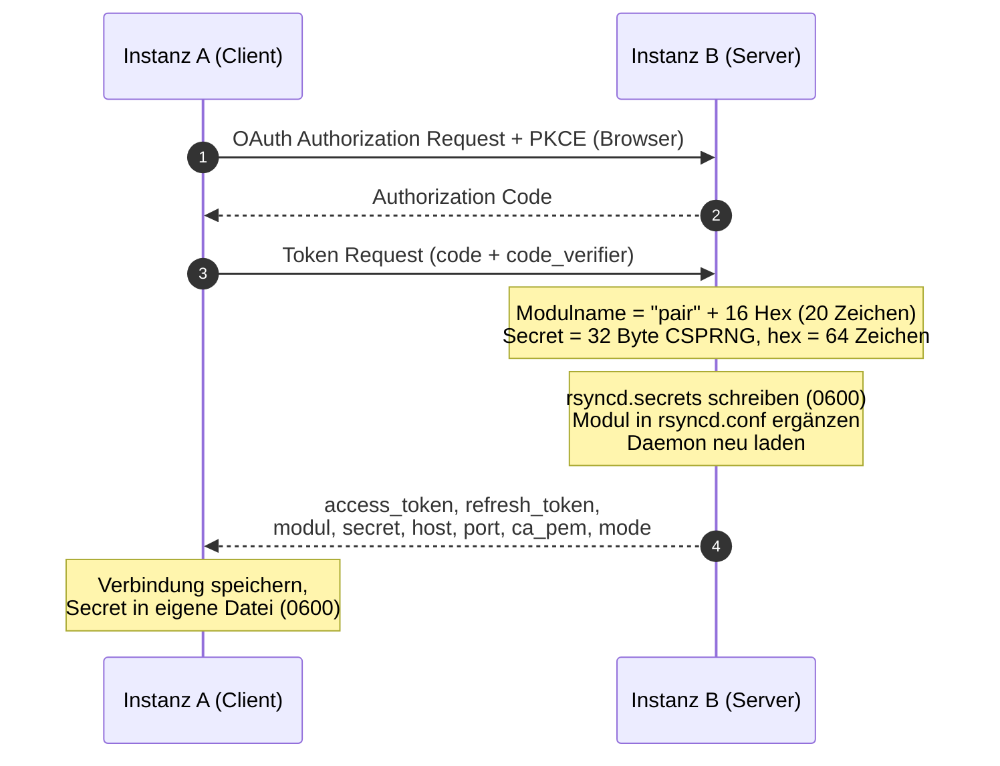
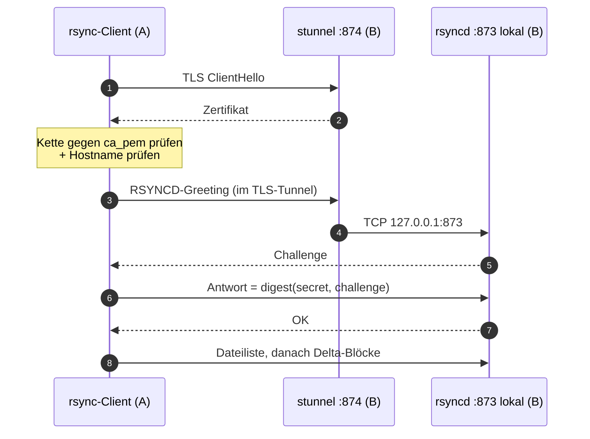

# rsync-Transport zwischen rclone-gui-Instanzen

Ergebnis des Spikes zu Ticket `19adf6ba` (Epic `6b8fd434`).

Alles in diesem Dokument ist gemessen, nicht angenommen. Zu jeder Aussage steht der
Befehl, mit dem sie reproduzierbar ist. Wo der Entwurf aus dem Epic nicht trägt, steht
das ausdrücklich dabei.

> **Stand 16.08.2026 — nachgeführt.** Die **Messwerte** des Spikes sind unverändert;
> sie wurden von einem zweiten Agenten unabhängig reproduziert (Ersttransfer
> 209.766.521 B gegen die hier dokumentierten 209.766.518 B, die 1-Byte-Änderung exakt
> 72.537 B, der Same-Second-Fallstrick exakt 74 B mit inhaltlich falschem Ziel, die
> flock-Meldung wörtlich).
>
> Nachgeführt wurden ausschliesslich die Stellen, die **Konfiguration** zeigen. Sie
> hinkten dem Code hinterher, und wer der alten Fassung folgte, baute die
> Datenverlust-Lücke wieder ein, die inzwischen geschlossen ist. Maßgeblich ist immer
> `src/handlers/rsyncd.rs` (`REFUSED_OPTIONS` und `ModuleConfig::render`); dieses
> Dokument erklärt, **warum** dort steht, was dort steht.
>
> Ebenfalls korrigiert: die Zombie-Behauptung des Spikes (widerlegt, siehe
> „Daemon-Lebenszyklus") und die getroffenen Entscheidungen E1/E2.
>
> **Zweiter Durchgang, 16.08.2026.** Wieder ohne Eingriff in die Messwerte. Neu bzw.
> berichtigt:
> * Die **Rechtegrenze für `chroot()`** ist gelöst (Ticket `33eeb98c`,
>   `setcap cap_sys_chroot,cap_setgid=ep /usr/bin/rsync`) und jetzt im Abschnitt
>   „use chroot" beschrieben — samt Begründung, warum das **kein** `cap_add` und keine
>   Compose-Änderung braucht.
> * Die zugesagte **Erkennung des chroot-Fehlers über das Daemon-Log ist zurückgezogen**:
>   der Daemon protokolliert ihn nicht, nur der Client sieht ihn. Die Sichtbarkeit kommt
>   vom **Startcheck in `start.sh`**.
> * **Modulname** (`"pair"` + 16 Hex, nicht 12) und **Secretlänge** (64 Zeichen hex, nicht
>   32) an Code und Test angeglichen — relevant für `d32a90b9` und `9e83c167`.
> * Der Konfigurationsblock ist **nicht mehr spaltenausgerichtet**, sondern zeichengenau
>   die Ausgabe von `ModuleConfig::render`.
> * Der `speedup`-Wert 2.279.513 war der **falschen Zeile** zugeordnet; er gehört zum
>   74-B-Lauf. Der Wert selbst ist unverändert.

## Kurzfassung

Der Entwurf trägt **im Kern**, aber drei seiner Annahmen sind falsch:

| Annahme im Epic | Befund |
|---|---|
| `auth digest = sha512` schützt vor Downgrade | **Falsch für dieses Image.** Alpines rsync ist ohne `openssl-crypto` gebaut, `Daemon auth list: md5 md4`. Der Parameter existiert in rsync 3.4.1 zudem gar nicht. **Der Parameter wird deshalb gar nicht mehr gesetzt** — er ist keine Option, siehe „Auth-Digest". |
| „ab rsync 3.2.7 mit openssl standardmässig sha512" | Gilt für Debian/Fedora, **nicht für Alpine** — in keiner Version von 3.19 bis 3.22. |
| `use chroot` ist die Isolationsgrenze | Auf alpine:3.19 brach `use chroot = yes` jeden Transfer (exit 23, musl 1.2.4); ab alpine:3.20 behoben, das Image steht auf 3.22. Die App setzt heute `use chroot = yes`, und es **wirkt** im ausgelieferten Container: die Rechtegrenze (`chroot()` als `appuser`) ist mit Ticket `33eeb98c` über eine Datei-Capability auf `/usr/bin/rsync` gelöst, siehe „use chroot". Als *alleinige* Isolationsgrenze taugt es trotzdem nicht — sie hängt an der Container-Konfiguration, `refuse options` nicht. |

Delta-Übertragung, Resume, Modulgrenzen und der TLS-Modus funktionieren wie
beschrieben und sind unten mit Zahlen belegt.

## Testaufbau

Zwei Container im Docker-Netz `rsyncpoc`, beide aus einem Image, das die Runtime-Stage
des Projekt-`Dockerfile` nachbaut (alpine:3.19, `rsync=3.4.1-r1`, `openssl=3.1.8-r1`,
`stunnel=5.72-r0`, `bash=5.2.21-r0`) — ohne den Rust-Build.

```
peera   Client
peerb   Daemon + stunnel      (Modulwurzel /data/share, daneben /data/geheim)
peerdeb Gegenprobe glibc      (debian:bookworm-slim, rsync 3.2.7)
Host    Gegenprobe rsync 3.5.0 (Protokoll 32, mit openssl-crypto)
```

Versionen und Fähigkeiten der drei rsync-Builds (`rsync --version`):

| | Version | Optimizations | Daemon auth list |
|---|---|---|---|
| alpine:3.19 | 3.4.1 | **no openssl-crypto**, asm-MD5 | `md5 md4` |
| alpine:3.20–3.22 | 3.4.3 | **no openssl-crypto** | `md5 md4` |
| debian:bookworm | 3.2.7 | openssl-crypto | `sha512 sha256 sha1 md5 md4` |
| Host (Arch) | 3.5.0 | openssl-crypto | `sha512 sha256 sha1 md5 md4` |

Alle vier sprechen Protokollversion 32.

## Von der App erzeugte Konfiguration

**Maßgeblich ist der Code**, nicht dieser Abschnitt: `REFUSED_OPTIONS` und
`ModuleConfig::render` in `src/handlers/rsyncd.rs`. Was hier steht, ist der
ausgelieferte Stand mitsamt der Begründung jeder Zeile.

`rsyncd.conf`, **zeichengenau so, wie `RsyncdConfig::render_conf` sie schreibt**
(Modulname und Secret stammen aus dem Pairing; der Name unten ist ein echter, über
`cargo test dump_for_real_rsync -- --ignored` erzeugter Wert):

```ini
# Generated by rclone-gui. Do not edit, this file is overwritten.
# No "auth digest": rsync on Alpine is built without openssl-crypto and
# offers md5/md4 only. See docs/rsync-transport.md.
address = 127.0.0.1
port = 873
# no "proxy protocol": rsync 3.4.3 resets every connection unless the
# TLS terminator sends a PROXY header. See docs/rsync-transport.md.

[pair2ef0d77e70d831e0]
    path = /data/share
    auth users = pair2ef0d77e70d831e0
    secrets file = /etc/rsyncd/secrets/rsyncd.secrets
    list = no
    read only = no
    use chroot = yes
    munge symlinks = yes
    uid = 1001
    gid = 1001
    max connections = 4
    temp dir = /.rsync-tmp
    refuse options = copy-links copy-dirlinks copy-unsafe-links delete remove-source-files
```

> **Der Block ist bewusst nicht spaltenausgerichtet.** `render_conf` und
> `ModuleConfig::render` (`src/handlers/rsyncd.rs`) schreiben **ein** Leerzeichen um
> jedes `=` und vier Leerzeichen Einrückung — nicht mehr. Eine frühere Fassung dieses
> Dokuments hat den Block der Lesbarkeit halber ausgerichtet (`port    = 873`); wer ihn
> als Referenz für einen Vergleich oder einen Test heranzog, bekam einen Unterschied,
> den es im Code nicht gibt. Die Schlüsselreihenfolge stimmt und ist ebenfalls die des
> Codes.

**Modulname: `"pair"` + 16 Hexzeichen, 20 Zeichen gesamt.** `MODULE_NAME_RANDOM_BYTES = 8`
(`rsyncd.rs`) → 8 Zufallsbytes, hex gerendert. Ältere Fassungen dieses Dokuments zeigten
12 Hexzeichen; das war falsch und ist für Feldbreiten und Validierungen in `d32a90b9`
(Pairing) und `9e83c167` (Remote-Browsing) relevant. **Secret: `SECRET_BYTES = 32`, aber
ebenfalls hex-kodiert — also 64 Zeichen**, nicht 32. Beides deckt der Test in
`rsyncd.rs` ab (`secret.len() == SECRET_BYTES * 2`).

`rsyncd.secrets` — eine Zeile `modul:secret`, Modus 0600. Beide Dateien 0600, per
`rename` ersetzt; die Reihenfolge (erst Secrets, dann Conf beim Anlegen; umgekehrt beim
Revoke) ist keine Kosmetik, siehe „Modul zur Laufzeit ändern".

Was **nicht** in der Datei steht, sondern beim Start auf der Kommandozeile mitgegeben
wird (`--dparam=pid file=…`, `--dparam=lock file=…`, `--log-file=…`), damit die
generierte Datei eine reine Modulbeschreibung bleibt: siehe „Daemon-Lebenszyklus".

Kleiner, aber beim Nachstellen relevanter Punkt: `argv()` gibt zusätzlich `--port=<port>`
mit, obwohl `port` auch in der Datei steht. Die Kommandozeile gewinnt. Im Regelbetrieb
sind beide `873`; wer den Daemon für einen Test auf einem anderen Port hochzieht, ändert
also den Wert in den `DaemonSettings`, nicht den in der Conf — eine Änderung nur in der Datei
bleibt wirkungslos.

`address = 127.0.0.1` ist fest verdrahtet. Es gibt bewusst **keinen Zweig** für einen
Direktmodus: eine Konfiguration, die „auf 0.0.0.0 lauschen" gar nicht ausdrücken kann,
lässt sich auch von einem Fehler nicht dazu überreden (Entscheidung E2, siehe unten).

### `refuse options` — die vollständige Liste, und warum das Wort `delete` bar steht

```
refuse options = copy-links copy-dirlinks copy-unsafe-links delete remove-source-files
```

Die ersten drei Einträge schliessen den Symlink-Ausbruch (siehe „Modulgrenzen"), die
letzten beiden den **Datenverlust**: eine Kopplung vergibt Schreibrecht, und ohne diese
zwei Einträge darf ein Peer, der schreiben darf, auch **vernichten**. Gemessen: ein Push
mit `--delete` löschte jede Datei im Share, die der Sender nicht hatte — exit 0, keine
Warnung. `remove-source-files` ist dieselbe Waffe in die andere Richtung, es räumt das
Verzeichnis der **Quellseite** leer.

**Die Wildcard `delete*` ist kein „aufgeräumtes" Äquivalent, sondern eine
Abschwächung.** Gemessen an einem echten Daemon auf **beiden** Versionen, die im Spiel
sind — 3.5.0 auf dem Host und 3.4.3 in `alpine:3.22`, dem Image — mit schreibbarem Modul
und einer Opferdatei im Share:

| Eintrag in `refuse options` | `--delete`, `-before`, `-during`, `-delay`, `-after`, `-excluded`, `--del` | `--delete-missing-args` |
|---|---|---|
| `delete` | verweigert, exit 4 | verweigert, exit 4 |
| `delete*` | verweigert, exit 4 | **durchgelassen, exit 0** |
| `delete delete*` | verweigert, exit 4 | **durchgelassen, exit 0** |

Ein Tester hat alle neun Varianten einzeln gegengeprüft; mit dem baren Wort endet jede
mit exit 4.

Der Grund: das bare Wort ist in rsync eine **Gruppen**-Verweigerung — es markiert die
ganze delete-Familie, `--delete-missing-args` eingeschlossen. Ein Wildcard-Eintrag
schaltet auf einen reinen Namensvergleich über die Optionstabelle um, und
`--delete-missing-args` wird so nicht erreicht. Die Wildcard **ersetzt** die Gruppe,
sie ergänzt sie nicht — auch dann, wenn beide nebeneinander stehen.

`--delete-missing-args` ist kein harmloser Randfall: es löscht auf dem **Empfänger**
genau die Dateien, deren Argumente beim Sender fehlen, zerstört also bestehenden Inhalt
im Share wie `--delete` selbst.

**Diese Stelle darf nicht „vereinfacht" werden.** Wer aus den beiden Einträgen eine
Wildcard macht, macht die Regel schwächer, obwohl das Gegenteil danach aussieht.

Löschen ist heute **bedingungslos** verweigert, für jede Kopplung, weil es im Modell
noch keinen Scope gibt, der „dieser Peer darf löschen" ausdrücken könnte. Sobald
`rsync:delete` existiert, wird die Konstante eine Funktion der Scopes einer Kopplung —
die delete-Einträge fallen für eine Kopplung mit diesem Scope weg,
`remove-source-files` bleibt in jedem Fall verweigert, weil es Daten auf einer Seite
zerstört, über die die Kopplung nichts aussagt.

### `list = no` ist Pflicht, nicht Kosmetik

Der Modulname ist aus dem CSPRNG gezogen und ausdrücklich **keine** Funktion des
freigegebenen Verzeichnisses — wer weiss, dass ein Peer `/data/photos` exportiert, soll
daraus nicht ableiten können, was nach `rsync://host/` zu tippen ist.

Dieser Schutz ist ohne `list = no` **wertlos**: ein `rsync rsync://host:873/` listet
sonst **anonym**, ohne jedes Secret, alle Modulnamen auf. Mit `list = no` ist die
Ausgabe leer, exit 0. Der unerratbare Name und `list = no` gehören zusammen; einer von
beiden allein trägt nicht.

### `max connections` braucht eine Lock-Datei

`max connections` ist ohne Lock-Datei nicht benutzbar, und der eingebaute Standard ist
`/var/run/rsyncd.lock`. Ist dieser Pfad nicht schreibbar, scheitert **jeder** Transfer
mit `@ERROR: failed to open lock file` — nicht nur der eine über dem Limit. Die App gibt
den Pfad deshalb beim Start als `--dparam=lock file=<run_dir>/rsyncd.lock` mit.

### `temp dir` statt `--partial-dir` auf der Serverseite

Standardmässig schreibt rsync `.<name>.XXXXXX` **neben** die Zieldatei und benennt am
Ende um. Ein hart getöteter Daemon kommt nie zum Umbenennen, die Reste bleiben für immer
im Share (85 MB nach einem Testlauf, siehe „Abbruch und Wiederaufnahme"). Sie hinterher
am Namen zu erkennen geht **nicht** sicher: `.ssh.config`, `.env.docker`, `.bashrc.backup`
und `.npmrc.backup` haben exakt dasselbe Muster wie ein rsync-Temp-File.

`temp dir = /.rsync-tmp` nimmt das Raten heraus — Partials landen in
`<share>/.rsync-tmp/`, und Aufräumen heisst „ein Verzeichnis leeren, das uns gehört"
statt „fremde Dateien auf Verdacht löschen". Gemessen auf 3.4.3 und 3.5.0:

- Der Wert wird **in beiden chroot-Modi relativ zur Modulwurzel** aufgelöst. Mit
  `use chroot = yes` ist die Modulwurzel `/`; mit `use chroot = no` stellt rsync den
  Modulpfad selbst voran (ein `temp dir` von `/probe/share/.rsync-tmp` bei einem Modul
  auf `/probe/share` wurde zu `/probe/share/probe/share/.rsync-tmp`, der Daemon startete
  nicht). Der führende Slash ist also richtig und bleibt in beiden Modi richtig — auch
  dort, wo chroot mangels Rechten nicht greift.
- Das Verzeichnis **muss existieren** — `The temp-dir does not exist` ist ein fataler
  Fehler zum Verbindungszeitpunkt. Jeder Schreibpfad legt es deshalb an.
- Der Modulparameter `exclude` würde das Verzeichnis aus dem Listing nehmen, lässt den
  Daemon auf 3.4.3 aber die Client-Optionen rundweg ablehnen (`requested action not
  supported`, exit 4) — dann geht gar kein Transfer mehr. Das Verzeichnis ist also im
  Modul sichtbar, und das ist der Preis.
- Ein Modul mit `read only = yes` empfängt nie eine Datei und bekommt deshalb **kein**
  `temp dir`; es wird auch kein Verzeichnis in fremden Shares angelegt.

### Datei-Modi sind Pflicht, nicht Kür

rsync prüft „strict modes" und bricht bei falschen Rechten ab. Gemessene Meldungen:

| Situation | Meldung |
|---|---|
| `--password-file` mit Modus 0644 | `ERROR: password file must not be other-accessible` (exit 1) |
| `--password-file` gehört nicht dem laufenden Nutzer | `ERROR: password file must be owned by root when running as root` (exit 1) |
| `secrets file` gehört nicht dem Daemon-Nutzer | Log: `secrets file must be owned by root when running as root (see strict modes)`, Client sieht nur `@ERROR: auth failed` |

Der letzte Fall ist der unangenehme: der Client bekommt dieselbe Meldung wie bei einem
falschen Secret. **Die App muss die Rechte beim Schreiben selbst setzen** (0600, Owner =
der Nutzer, unter dem der Daemon läuft) und darf sich nicht auf `docker cp` o.ä.
verlassen.

Das Secret steht in beiden Modi nur in Dateien, nie in `argv` und nie in
`RSYNC_PASSWORD`.

## Ablauf

### Pairing (einmalig)



Der Nutzer sieht Modulname und Secret nie. Beim Token-Refresh kann B ein neues Secret
erzeugen und mitliefern; ein Reload des Daemons genügt (siehe „Daemon-Lebenszyklus").

### Sync, Modus TLS (Standard)



Client-Aufruf (gemessen):

```bash
RSYNC_SSL_TYPE=openssl RSYNC_SSL_CA_CERT=/etc/rsyncd/certs/peer-ca.crt \
rsync-ssl -a --stats \
  --password-file=/etc/rsyncd/secrets/<peer>.pw \
  --modify-window=-1 --munge-links \
  /quelle/ rsync://<modul>@<host>:874/<modul>/<zielpfad>
```

(So gemessen wurde er mit `--partial-dir=.rsync-partial`; das ist inzwischen durch
`temp dir` auf der Serverseite ersetzt. `--modify-window=-1` bleibt Pflicht.)

stunnel-Konfiguration auf B (statt nginx/haproxy — stunnel liegt bereits im Image und
braucht keinen zusätzlichen Dienst):

```ini
foreground = no
pid = /etc/rsyncd/stunnel.pid
[rsyncd-tls]
accept     = 0.0.0.0:874
connect    = 127.0.0.1:873
cert       = /etc/rsyncd/certs/srv.pem
sslVersion = TLSv1.2
```

### `proxy protocol` ist auf **beiden** Seiten aus — halbe Aktivierung bricht alles

Die `proxy protocol`-Variante aus der rsync-Doku (Terminator sendet einen PROXY-Header,
`proxy protocol = true` in `rsyncd.conf`) wird hier **nicht** gebraucht. Sie liefert dem
Daemon nur die echte Client-IP fürs Log; da die Zugriffskontrolle über `auth users` und
nicht über `hosts allow` läuft, bringt sie nichts.

Wichtiger ist, dass die Einstellung **nur ganz oder gar nicht** funktioniert. Der Daemon
erwartet den Header dann von jeder Verbindung; schickt der Terminator keinen, bricht die
Verbindung ab — auf 3.4.3 **ohne einen einzigen Eintrag im rsyncd-Log**. Gemessen:

| Daemon | `proxy protocol = true` allein | zusätzlich `proxy protocol hosts` |
|---|---|---|
| 3.4.3 (alpine:3.22, unser Image) | startet sauber, aber **jeder** Client wird zurückgesetzt: `safe_read failed to read 1 bytes: Connection reset by peer (104)`, exit 12, **nichts im Daemon-Log** | `Unknown Parameter encountered: "proxy protocol hosts"` — still ignoriert, der Reset bleibt |
| 3.5.0 (Host) | warnt beim Start: `"proxy protocol = true" but "proxy protocol hosts" is unset: all connections will be rejected as untrusted proxy peers` | wird ohne Warnung angenommen |

Es gibt also keine Fassung, die auf beiden Versionen zugleich warnungsfrei und
funktionsfähig wäre. Die App rendert die Zeile deshalb gar nicht (auch nicht als
`= false`) und schreibt stattdessen einen Kommentar in die Datei, damit die Auslassung
als Entscheidung erkennbar bleibt. Der Schalter existiert im Code
(`DaemonConfig::with_proxy_protocol`), weil nur das Lifecycle-Ticket beide Enden
gleichzeitig umstellen kann.

**Die echte Peer-IP steht im stunnel-Log, nicht im rsyncd-Log.** Wer die Herkunft einer
Verbindung sucht, schaut dort — im rsyncd-Log steht `127.0.0.1`, und das ist korrekt.

Gemessen (Netz `netstat -ltn` auf B):

```
tcp 0 0 0.0.0.0:874     LISTEN  stunnel
tcp 0 0 127.0.0.1:873   LISTEN  rsync
```

Ein Verbindungsversuch von A direkt auf 873 endet mit
`failed to connect to peerb (192.168.224.2): Connection refused (111)` — der Daemon ist
von aussen nicht erreichbar.

### Sync, Modus Direkt (nur LAN/VPN) — **entfallen**

> **Entscheidung E2 ist gefallen: der Direktmodus ist nicht im Produkt.** Die App kennt
> nur `address = 127.0.0.1` und hat keinen Zweig, der etwas anderes rendern könnte.
> Der Abschnitt bleibt stehen, weil die Messungen unten im Direktmodus entstanden sind.

Der Aufbau war: identisch, aber `address = 0.0.0.0`, Port 873, ohne stunnel und ohne
`rsync-ssl`. **Die Daten laufen im Klartext, und die Authentifizierung ist
MD5-Challenge-Response** (siehe „Auth-Digest") — im Klartext ist das der einzige Schutz,
und genau deshalb ist er gestrichen.

## Zertifikatsprüfung

`rsync-ssl` mit `RSYNC_SSL_TYPE=openssl` ruft `openssl s_client -verify_return_error`
auf. Beide Prüfungen greifen, gemessen:

| Test | Ergebnis |
|---|---|
| korrekte CA, Hostname `peerb` = SAN | Transfer läuft, 52.441.790 B gesendet |
| fremde CA in `RSYNC_SSL_CA_CERT` | `verify error:num=20:unable to get local issuer certificate` → `rsync: did not see server greeting` (exit 5) |
| korrekte CA, aber Verbindung über IP statt DNS-Name | `verify error:num=62:hostname mismatch` (exit 5) |

Konsequenz für das Pairing: B muss **den Hostnamen mitliefern, der im SAN steht**, und A
muss genau diesen verwenden. Ein Peer-Eintrag, der nur eine IP kennt, funktioniert nur,
wenn die IP als `IP:`-SAN im Zertifikat steht.

## Delta-Übertragung — Zahlen

Alle Werte aus `--stats`, Direktmodus, 200 MiB Zufallsdatei (209.715.200 B).

| Lauf | Literal | Matched | **Total bytes sent** | Anteil an der Dateigrösse |
|---|---:|---:|---:|---:|
| Erstübertragung | 209.715.200 | 0 | **209.766.518** | 100,02 % |
| 1 MiB in der Mitte geändert | 1.057.040 | 208.658.160 | **1.115.066** | 0,53 % |
| 1 Byte geändert | 14.480 | 209.700.720 | **72.537** | 0,035 % |

`speedup` laut rsync für die 1-MiB-Zeile: **172,39**. sha256 von Quelle und Ziel danach
identisch.

> **Korrektur einer Zuordnung, nicht einer Messung.** Ältere Fassungen führten hier
> „172,39 bzw. 2.279.513" so auf, als gehörte der zweite Wert zur 1-Byte-Zeile. Das geht
> rechnerisch nicht auf: rsync bildet `speedup = Dateigrösse / (sent + received)`, und
> 209.715.200 / 2.279.513 = **92 B** Gesamtverkehr. 92 B sind sent 74 + received 18 —
> also der Lauf aus „Änderung in derselben Sekunde wird still übersprungen", bei dem
> rsync die Datei gar nicht anfasst. Mit den 72.537 gesendeten Bytes der 1-Byte-Zeile
> ist der Wert unvereinbar (das wären rund 1.200). Der Zahlenwert selbst bleibt
> unverändert — er stand nur an der falschen Zeile und ist deshalb dorthin verschoben,
> wo er hingehört.

Über TLS identisch, 50 MiB Datei, 1 MiB geändert: Literal 1.057.040, Matched 51.371.760,
**1.085.821 B gesendet** (2,07 %), speedup 46,13. Der TLS-Tunnel kostet nichts an
Delta-Effizienz.

Reproduktion:

```bash
dd if=/dev/urandom of=/d/gross.bin bs=1M count=200
rsync -a --stats --password-file=/tmp/pw /d/ rsync://$M@peerb:873/$M/
dd if=/dev/urandom of=/d/gross.bin bs=1M seek=100 count=1 conv=notrunc
rsync -a --stats --password-file=/tmp/pw /d/ rsync://$M@peerb:873/$M/
```

### Fallstrick: Änderung in derselben Sekunde wird still übersprungen

rsyncs Quick-Check vergleicht Grösse und mtime, standardmässig auf **ganze Sekunden**
genau. Eine Änderung, deren mtime in dieselbe Sekunde fällt wie der letzte Sync, wird
übersehen — ohne Fehler, ohne Warnung.

Deterministische Reproduktion:

```bash
SEC=$(stat -c %Y ziel/gross.bin)          # Sekunde des letzten Syncs
printf 'Z' | dd of=/d/gross.bin bs=1 seek=1000 conv=notrunc
touch -d @$SEC /d/gross.bin                # gleiche Sekunde, anderer Inhalt
rsync -ai --stats --password-file=/tmp/pw /d/ rsync://$M@peerb:873/$M/
```

Gemessen:

| Aufruf | gesendet | Ziel danach |
|---|---:|---|
| `rsync -a` (Standard) | 74 B | **inhaltlich falsch**, sha256 weicht ab |
| `rsync -a --modify-window=-1` | 72.537 B | korrekt |
| `rsync -a --checksum` | 72.559 B | korrekt |

Der Standardlauf meldet `speedup 2.279.513` — 209.715.200 / (74 gesendet + 18 empfangen).
Ein vierstellig bis siebenstellig hoher `speedup` ist deshalb **kein** Erfolgsindikator,
sondern hier genau das Warnsignal: rsync hat die Datei nicht angefasst.

**Empfehlung: `--modify-window=-1` immer setzen.** Es vergleicht Nanosekunden
(Empfänger ab rsync 3.1.3), kostet nichts und schliesst die Lücke. `--checksum` schliesst
sie auch, liest aber beide Seiten komplett — bei grossen Beständen zu teuer für den
Normalfall.

## Modulgrenzen

### Pfad-Ausbruch: hält

Gemessen wurde mit `use chroot = no`, wo `sanitize paths` aktiv ist (Standard) — das ist
der **ungünstigere** Fall: mit `use chroot = yes`, wie die App es heute rendert, kommt
die chroot-Grenze zusätzlich darunter. Alle Versuche landen innerhalb des Moduls:

| Zielpfad im Aufruf | Ergebnis |
|---|---|
| `.../<modul>/../geheim/` | Datei landet als `/data/share/geheim/datei1.txt` |
| `.../<modul>//data/geheim/` | landet als `/data/share/etc/...` bzw. schlägt fehl |
| `.../<modul>/%2e%2e/geheim/` | `mkdir "%2e%2e/geheim" failed` — keine URL-Dekodierung |
| `.../<modul>/../../etc/` | landet als `/data/share/etc/datei1.txt` |

`/data/geheim/nichtlesbar.txt` blieb in allen Fällen unangetastet, `/etc` auf B
unverändert. **Ein Ausbruch über Pfadangaben ist nicht möglich.**

### Symlink-Ausbruch: hält NUR mit `refuse options`

Das ist der Befund, der den Entwurf am stärksten korrigiert.

Ein Symlink, den ein Client **über rsync schreibt**, wird entschärft: `munge symlinks =
yes` macht aus `/data/geheim` den unbrauchbaren Wert `/rsyncd-munged//data/geheim`; auch
ohne munge greift `sanitize paths` und macht daraus das modulinterne `data/geheim`. Ein
zweiter Push „durch" den Link scheitert (`mkdir "ausbruch" failed: File exists`, exit 11).

Ein Symlink, der **im Share schon liegt** — vom lokalen Nutzer über die GUI oder das
Dateisystem angelegt — ist etwas anderes. `munge symlinks` greift dafür nicht.
Gemessen, `use chroot = no`:

```bash
# auf B, ausserhalb von rsync angelegt:
ln -sf /etc/passwd /data/share/leak
# auf A:
rsync -aL --password-file=/tmp/pw rsync://$M@peerb:873/$M/ /pull/
```

Ergebnis: `/pull/leak` enthält `/etc/passwd` **des Servers** (1278 Bytes, beginnend mit
`root:x:0:0:root:/root:/bin/ash`). Das gilt mit `munge symlinks = yes` genauso wie mit
`= no`.

Zwei Gegenmittel, beide gemessen:

1. **Serverseitig** `refuse options = copy-links copy-dirlinks copy-unsafe-links`
   (das sind die drei Einträge gegen *diesen* Angriff; die ausgelieferte Liste ist
   länger, siehe „`refuse options` — die vollständige Liste").
   Der Client bekommt dann `rsync: The server is configured to refuse --copy-links (-L)`
   (exit 10). Ohne `-L` wird der Symlink nur als Symlink kopiert; Serverdaten fliessen
   nicht ab. `-K`/`--keep-dirlinks` ist harmlos (nur empfängerseitig) und muss nicht
   verweigert werden.
2. **`use chroot = yes`.** Dann existiert `/etc/passwd` innerhalb des chroot nicht,
   und der Server meldet `symlink has no referent: "/leak"`. Gegen den glibc-Daemon
   verifiziert: nur `f.txt` kommt an, kein Leak.

Die App setzt **beides**. `refuse options` ist dabei nicht die zweite Wahl, sondern die
Schicht, die auch dann trägt, wenn chroot nicht greift. Im ausgelieferten Image greift
chroot seit Ticket `33eeb98c` (siehe „use chroot"), aber es hängt an der
Container-Konfiguration: ein `--cap-drop=SYS_CHROOT` beim Fremdbetreiber nimmt es weg.
`refuse options` steht dagegen in der generierten Datei und lässt sich von aussen nicht
abschalten. Wer nur auf chroot baut, hat in einem so konfigurierten Container gar
keinen Schutz.

Zusätzlich sollte der **empfangende** Client `--munge-links` setzen. Gemessen: der
eingehende Link landet dann als `dirleak -> /rsyncd-munged//etc` und kann auf der
Empfängerseite nichts mehr aufmachen.

### `read only = yes`

```
ERROR: module is read only
rsync error: syntax or usage error (code 1) at main.c(1150) [Receiver=3.4.1]
```

Lesen aus demselben Modul funktioniert. `list = no` blendet das Modul aus dem
Listing (`rsync rsync://host:873/`) aus — die Ausgabe ist leer, exit 0.

## `use chroot`

**Stand: die App rendert `use chroot = yes`** (`ModuleConfig::render`). Das musl-Problem
unten ist erledigt — das Basis-Image steht auf `alpine:3.22` (Ticket `3f276e8c`), und ab
`alpine:3.20` tritt es nicht mehr auf.

Es hat einmal an einer **zweiten** Hürde gehangen — der Rechtegrenze —, und die ist
inzwischen gelöst. Beides steht unten: erst wie, dann warum die ursprünglich
vorgesehene Erkennung dieses Fehlers nicht funktioniert.

### Die Rechtegrenze: `chroot()` als `appuser` (Ticket `33eeb98c`, erledigt)

Der Container läuft als `USER appuser` (uid 1001), also auch der von der App gestartete
rsync-Daemon. `chroot()` verlangt `CAP_SYS_CHROOT`, und ein unprivilegierter Prozess hat
keine effektiven Capabilities. Der Daemon scheiterte deshalb im ausgelieferten Container
mit `chroot("/data/modA") failed: Operation not permitted (1)`, der Client sah
`@ERROR: chroot failed`, exit 5. Ein scheiterndes `chroot()` bricht die Verbindung
**vor** dem Transfer ab — der Transport war damit nicht bloss eine Schicht dünner,
sondern vollständig unbenutzbar. Alle vorherigen Nachweise waren mit einem manuell als
root gestarteten Daemon entstanden und hatten das nicht gesehen.

**Behoben im `Dockerfile` über eine Datei-Capability, nicht über `cap_add`:**

```dockerfile
RUN setcap cap_sys_chroot,cap_setgid=ep /usr/bin/rsync && \
    getcap /usr/bin/rsync | grep -q 'cap_setgid.*cap_sys_chroot\|cap_sys_chroot.*cap_setgid'
```

Warum das der richtige Weg ist:

* `CAP_SYS_CHROOT` und `CAP_SETGID` liegen **bereits im Default-Bounding-Set von Docker**
  (gemessen: `CapBnd=00000000a80425fb` in einem nackten `docker run alpine:3.22`). Eine
  Datei-Capability wird daraus beim `exec` in das Permitted-Set gehoben — auch für
  uid 1001. Deshalb **kein `cap_add`, keine Änderung an `docker-compose.yml`, kein
  Wechsel weg von `USER appuser`**. Wer sein eigenes Compose-File oder ein `docker run`
  benutzt, bekommt chroot ohne eine Zeile Zusatzkonfiguration; ein vergessenes `cap_add`
  wäre sonst ein stiller Ausfall bei jedem Fremdbetreiber.
* Die Erweiterung hängt an **einer** Binärdatei statt am ganzen Container. Der Rest des
  Images bleibt unprivilegiert, die App läuft nicht als root.

Warum zusätzlich `CAP_SETGID`, und warum ausdrücklich **nicht** `CAP_SETUID`: sobald
rsync `CAP_SYS_CHROOT` besitzt, hält es sich für privilegiert genug, die Modul-Identität
zu wechseln, und führt für `uid`/`gid` aus der generierten Modulkonfiguration
`setgid`/`setgroups`/`setuid` aus. Gemessen: nur mit `CAP_SYS_CHROOT` bleibt es bei
`rsync: [Receiver] setgroups failed: Operation not permitted (1)` /
`@ERROR: setgroups failed` (exit 5) — der chroot selbst gelingt da schon.
`setgroups()` verlangt `CAP_SETGID`. `setgid(1001)`/`setuid(1001)` sind dagegen Wechsel
auf die *eigene* Identität und brauchen keine Capability. `CAP_SETUID` bleibt deshalb
draussen: es wäre ein vollständiger Weg von `appuser` nach uid 0 im Container und damit
die faktische Aufhebung von `USER appuser`. `CAP_SETGID` erlaubt gid 0, was ohne
gruppenschreibbare root-Pfade im Image folgenlos bleibt.

**Nachgewiesen** über die volle Kette — Peer → TLS 874 → stunnel → rsyncd:873 → chroot —
mit dem **von der App gestarteten** Daemon im ausgelieferten Image, durchgängig als
uid 1001: rc 0, Prüfsumme auf beiden Seiten identisch.

> **Nebenbefund, der beim Betrieb zählt:** eine Datei-Capability, die **nicht** im
> Bounding-Set des Containers liegt, wird nicht etwa ignoriert — schon das `exec` von
> rsync scheitert mit `EPERM`, und rsync ist dann überhaupt nicht mehr aufrufbar, auch
> `rsync --version` nicht. `--cap-drop=SYS_CHROOT`, `--cap-drop=SETGID` oder
> `--security-opt no-new-privileges` legen den Transport also **lahm**, statt ihn zu
> degradieren. Dasselbe gilt für ein Dateisystem ohne xattr-Unterstützung.

### Sichtbar wird ein fehlendes chroot über den Startcheck — **nicht** über das Daemon-Log

Eine frühere Fassung dieses Dokuments sagte zu, `mirror_log_file` erkenne beide Hälften
des Fehlers (`chroot("<pfad>") failed: …` im Daemon-Log und `@ERROR: chroot failed` beim
Client) und hebe sie als Deployment-Fehler heraus. **Das trifft nicht zu, und die Zusage
ist hiermit zurückgezogen.**

Gemessen, rsync 3.4.3 als uid 1001 und rsync 3.5.0 als uid 1000, jeweils mit der von
`render` erzeugten Modulkonfiguration:

```
CLIENT:  @ERROR: chroot failed
         rsync error: error starting client-server protocol (code 5) at main.c(1865)
LOG:     … rsyncd version 3.4.3 starting, listening on port …
         … connect from localhost (127.0.0.1)
         … rsync allowed access on module m from localhost (127.0.0.1)
STDERR:  (leer)
STDOUT:  (leer)
```

**Keine** der beiden Hälften erreicht die Logdatei, stdout oder stderr — nur die
Gegenstelle sieht den Fehler. `is_chroot_failure_line` (`rsyncd.rs`) wird aber
ausschliesslich aus `handle_log_line` gespeist, und das kommt allein aus
`mirror_log_file`; `mirror_pipe` prüft nur auf `failed to lock pid file`. Die Erkennung
ist damit ein **Netz, das in dieser Konstellation nie greift**. Es schadet nicht und
bleibt für Konstellationen stehen, in denen der Daemon doch protokolliert — aber es ist
kein Nachweisweg, auf den sich ein Folgeticket stützen darf.

Der Weg, der tatsächlich trägt, ist der **Startcheck in `start.sh`** (aus `33eeb98c`):
vor dem Start der App wird ein **Wegwerf-Daemon** mit `use chroot = yes` und denselben
`uid`/`gid` aufgesetzt und angesprochen. Geprüft wird damit **Verhalten statt
Capability-Bits** — genau deshalb fällt auch der `setgroups`-Fall auf, der unabhängig
vom chroot scheitert. Schlägt die Probe fehl, gibt `start.sh` Grund, gesetzte
Datei-Capabilities (`getcap`), Soll-Zustand und das Bounding-Set aus und bricht ab,
sofern `RCLONE_GUI_RSYNCD=1` gesetzt ist (sonst nur eine Warnung — ohne Daemon hindert
ein fehlendes chroot niemanden). Beide Negativkontrollen — `--cap-drop=SYS_CHROOT` und
`--security-opt no-new-privileges` — wurden real erzeugt und brechen den Start mit
klarer Meldung ab.

Für Folgetickets heisst das: **die zuverlässige Fehlerquelle ist die Startausgabe,
nicht das rsyncd-Log.**

### Und trotzdem: `refuse options` bleibt die tragende Schicht

`use chroot = yes` wirkt jetzt. Das ändert nichts daran, dass `refuse options` gegen den
Symlink-Ausbruch nicht die „zweite Wahl" ist: chroot hängt an einer Container-Umgebung,
die ein Fremdbetreiber mit einem einzigen `--cap-drop` anders konfiguriert, `refuse
options` dagegen an der generierten Konfiguration selbst. Die App setzt beides, und
keine der beiden Schichten darf mit Verweis auf die andere entfallen.

### Historie: auf alpine:3.19 war chroot kaputt (behoben)

Mit `use chroot = yes` schlug auf dem damaligen Projekt-Image (alpine:3.19) **jeder**
Transfer fehl:

```
rsync: [receiver] failed to set permissions on "/.datei1.txt.ilHEcM"
       (in <modul>): No such file or directory (2)
rsync error: some files/attrs were not transferred (code 23)
```

Die Datei kommt an, aber mit Modus 0600 statt der Quellrechte, und rsync endet mit
exit 23. Für die Job-Auswertung ist das ein Fehlschlag.

Ursache, in vier Schritten eingegrenzt:

| Test | Ergebnis |
|---|---|
| `chroot=yes`, `uid=1001` / `uid=root` / ohne uid | scheitert immer (ohne uid schon beim `mkstemp`) |
| `chroot=yes` + `--no-perms` | **exit 0** → es ist der chmod-Pfad |
| `chroot=no` | exit 0, Rechte korrekt (`-rw-r--r--`) |
| `chroot=yes`, aber `/proc` in die Modulwurzel gemountet (`-v /proc:/data/share/proc`) | **exit 0**, Rechte korrekt |
| `chroot=yes` auf debian:bookworm (glibc, rsync 3.2.7) | exit 0 |

musl implementiert `fchmodat(…, AT_SYMLINK_NOFOLLOW)` über `/proc/self/fd/`. Im chroot
gibt es kein `/proc` → `ENOENT`. Das erklärt jede Zeile der Tabelle.

**Der Fehler ist ab alpine:3.20 weg**, gemessen — das Image steht auf 3.22, dieser
Fallstrick ist damit Geschichte:

| Basis | musl | rsync | `use chroot = yes` |
|---|---|---|---|
| alpine:3.19 | 1.2.4_git20230717-r6 | 3.4.1-r1 | **exit 23** |
| alpine:3.20 | 1.2.5-r3 | 3.4.3-r0 | exit 0 |
| alpine:3.21 | 1.2.5-r11 | 3.4.3-r0 | exit 0 |
| alpine:3.22 | 1.2.5-r12 | 3.4.3-r0 | exit 0 |

Reproduktion:

```bash
docker run -d --name t --network rsyncpoc alpine:3.19 sleep infinity
docker exec t apk add --no-cache rsync
# rsyncd.conf mit "use chroot = yes", Modul auf /data/share
rsync -a --password-file=/tmp/pw /src/datei1.txt rsync://$M@t:873/$M/ ; echo $?
```

## Auth-Digest — der Entwurf trägt hier nicht

> **`auth digest` ist keine Option und steht nicht zur Wahl.** Die App setzt den
> Parameter nicht und kann ihn nicht setzen; in der generierten `rsyncd.conf` steht an
> seiner Stelle ein Kommentar, damit die Auslassung als Entscheidung lesbar bleibt.
> Zweimal unabhängig gemessen, auch auf `alpine:3.22`: `no openssl-crypto`,
> `Daemon auth list: md5 md4`.
>
> **Entscheidung E1 ist gefallen: MD5-Challenge-Response wird akzeptiert.** Begründung:
> das Secret geht nie über die Leitung, und TLS schützt die Aushandlung zusätzlich
> (Server per Zertifikat authentifiziert, Verbindung verschlüsselt). Da der Direktmodus
> entfallen ist (E2), gibt es keinen Weg mehr, bei dem MD5 der einzige Schutz wäre.

Die Aufgabe „`auth digest = sha512` setzen und prüfen, dass ein schwächerer Client
abgewiesen wird" ist mit dem Projekt-Image **nicht erfüllbar**. Zwei unabhängige Gründe:

**1. Der Parameter existiert in rsync 3.4.1 nicht.** Beim Start protokolliert der
Daemon:

```
Unknown Parameter encountered: "auth digest"
IGNORING unknown parameter "auth digest"
```

Er läuft danach weiter — die Einstellung wirkt also stillschweigend nicht. In rsync
3.5.0 gibt es den Parameter (`man rsyncd.conf`, Abschnitt *AUTHENTICATION STRENGTH*)
und er wirkt.

**2. Alpines rsync kann kein SHA.** `rsync --version` meldet `no openssl-crypto` und

```
Daemon auth list:
    md5 md4
```

Das gilt für **jede** getestete Alpine-Version (3.19 bis 3.22, rsync 3.4.1 und 3.4.3).
Alpine baut rsync bewusst ohne OpenSSL. Debian bookworm (3.2.7) und der Host (3.5.0)
melden dagegen `sha512 sha256 sha1 md5 md4`.

Beides zusammen gemessen: ein rsync-3.5.0-Daemon mit `auth digest = sha512` im Modul
weist den Alpine-Client **in jedem Fall** ab, auch ohne jede Downgrade-Absicht:

```
@ERROR: auth failed on module <modul>            # was der Client sieht
```
```
auth failed on module <modul> from ...: negotiated auth digest md5
is weaker than the required 'auth digest = sha512'      # Daemon-Log
```

Das ist zugleich der Nachweis, dass die Einstellung funktioniert — nur eben so, dass
zwei Instanzen auf Basis dieses Images sich damit gegenseitig aussperren würden.

### Downgrade-Risiko konkret

Gegen den Alpine-Daemon (ohne `auth digest`, weil nicht unterstützt) lässt sich die
Verbindung beliebig herunterhandeln:

```bash
rsync -a --protocol=20 --debug=ALL1 --password-file=/tmp/pw \
      /etc/hostname rsync://$M@127.0.0.1:873/$M/
```

```
Client negotiated daemon auth checksum: md5
(Client) Protocol versions: remote=32, negotiated=20
Client checksum: md4
```

exit 0. Im Daemon-Log steht nur `Client is very old version of rsync, upgrade
recommended.` Auch `--protocol=29` und `--protocol=27` gehen durch.

Zwischen zwei rsync-3.5.0-Peers ist das nicht möglich: dort bleibt der Auth-Digest auch
mit `--protocol=20` auf `sha512`, weil die Digest-Aushandlung vor der
Protokollaushandlung stattfindet.

Einordnung: Das Secret geht auch bei MD5 **nicht** über die Leitung — es bleibt
Challenge-Response. Im TLS-Modus ist der gesamte Austausch zusätzlich verschlüsselt und
der Server per Zertifikat authentifiziert; das Restrisiko ist dort gering. Der
Direktmodus, in dem MD5-Challenge-Response über eine unverschlüsselte Verbindung der
einzige Schutz gewesen wäre, ist mit E2 gestrichen — damit ist genau der Fall weg, in
dem dieser Befund gewichtig gewesen wäre.

## Abbruch und Wiederaufnahme

300-MiB-Datei, `--bwlimit=20M`, Abbruch nach 5 s.

| Fall | auf dem Server danach | Wiederaufnahme sendet |
|---|---|---|
| Client abgebrochen, **ohne** `--partial` | nichts | **314.649.716 B** (alles neu) |
| Client abgebrochen, **mit** `--partial-dir=.rsync-partial` | `.rsync-partial/big.bin`, 106.528.768 B | **208.172.925 B** (−33,8 %) |
| Daemon per SIGTERM beendet | `.rsync-partial/big.bin`, 85.196.800 B | wird wiederverwendet |
| Daemon per SIGKILL beendet | `.big.bin.ONMClP`, 85.196.800 B, **verwaist im Modulwurzelverzeichnis** | wird **nicht** wiederverwendet |

sha256 nach der Wiederaufnahme in allen erfolgreichen Fällen identisch mit der Quelle.

Zwei Konsequenzen:

- Partials müssen an einen bekannten Ort. Der Spike empfahl dafür client-seitig
  `--partial-dir=.rsync-partial`; **umgesetzt ist stattdessen `temp dir` im Modul**
  (siehe „`temp dir` statt `--partial-dir`"), weil das auch dann greift, wenn der Client
  die Option nicht setzt — und die Serverseite ist die Seite, auf der die Reste liegen
  bleiben.
- Ein hart getöteter Daemon hinterlässt `.<name>.XXXXXX`-Reste, die rsync nie aufräumt.
  **Der Daemon muss per SIGTERM gestoppt werden**, und die App braucht trotzdem einen
  Aufräumschritt. Mit `temp dir` ist der harmlos: er leert nur `<share>/.rsync-tmp/`.
  Ein Sweep über das **Modulwurzelverzeichnis** wäre es nicht gewesen — am Namensmuster
  `.name.XXXXXX` lässt sich ein rsync-Temp-File nicht von `.env.docker` oder
  `.npmrc.backup` unterscheiden, ein solcher Sweep löschte im Test vier gewöhnliche
  Nutzerdateien je echtem Fund.

## Fehlerfälle und ihre Meldungen

Bewertet auf Tauglichkeit für eine UI-Meldung.

| Situation | rsync-Ausgabe | exit | UI-tauglich? |
|---|---|---|---|
| Falsches Secret | `@ERROR: auth failed on module <m>` | 5 | ja, aber mehrdeutig — dieselbe Meldung wie bei falschen Dateirechten der `secrets file` |
| Unbekanntes Modul | `@ERROR: Unknown module '<m>'` | 5 | ja („Kopplung auf der Gegenseite gelöscht") |
| Modul schreibgeschützt | `ERROR: module is read only` | 1 | ja |
| Falsche CA | `verify error:num=20:unable to get local issuer certificate` + `did not see server greeting` | 5 | nein, muss übersetzt werden |
| Hostname passt nicht zum Zertifikat | `verify error:num=62:hostname mismatch` | 5 | nein, muss übersetzt werden |
| Klartext-rsync gegen Port 874 | `safe_read failed to read 1 bytes: Connection reset by peer (104)` | 12 | **nein**, führt in die Irre |
| Daemon nicht erreichbar | `failed to connect to <host> (<ip>): Connection refused (111)` | 10 | ja |
| Fremder Dienst auf dem Port | `server sent "HTTP/1.1 400 Bad Request" rather than greeting` | 5 | ja, sogar sehr gut |
| `--protocol` unter dem Minimum | `--protocol must be at least 20 on the Client.` | **2** | ja |
| `--protocol` über dem Maximum | `connection unexpectedly closed (0 bytes received so far)` | 12 | nein |
| Daemon stirbt mitten im Transfer | `[sender] write error: Broken pipe (32)` | 10 | nein, muss übersetzt werden |
| Zweiter Daemon auf derselben PID-Datei | `failed to lock pid file <pfad>: Resource temporarily unavailable` | — | ja, brauchbar für den Lifecycle |

**Zur Protokollinkompatibilität:** eine echte Version-Inkompatibilität liess sich mit
den verfügbaren Builds nicht erzeugen — alle vier sprechen Protokoll 32, und rsync
handelt automatisch die höchste gemeinsame Version aus. Ein Bruch entsteht erst gegen
Gegenstellen jenseits von Protokoll 20 (rsync < 2.6.0, Baujahr 2004) oder gegen
Nicht-rsync-Implementierungen. Die Fehlermeldung ist dann exit 2 mit `protocol
incompatibility`, was für eine UI-Meldung ausreicht. **Praktisch relevanter als die
Protokollversion ist der Auth-Digest** (siehe oben) — der bricht schon zwischen rsync
3.4.1 und einer sha512-Anforderung.

Empfehlung: die App wertet den **Exit-Code** aus (2 = Protokoll, 5 = Auth/Modul,
10 = Netz, 11 = Datei-IO, 12 = Protokolldatenstrom, 23 = Teilfehler, 1 = Nutzungsfehler)
und mappt die oben genannten `@ERROR:`- und `verify error:`-Zeilen auf eigene Texte. Die
Rohausgabe gehört ins Job-Log, nicht in die Meldung.

## Modul zur Laufzeit ändern

Der Daemon liest `rsyncd.conf` bei **jeder** eingehenden Verbindung neu. Ein Reload-
Kommando, ein Signal oder ein Neustart sind nicht nötig und existieren bei rsync auch
nicht. Gemessen auf 3.4.3 (Image) und 3.5.0 (Host), beide gleich.

Beide Dateien werden per `rename` ersetzt, ein lesender Daemon sieht also nie eine halbe
Datei. Die zwei Umbenennungen sind aber nicht **eine** Operation, und dazwischen
widersprechen sich Conf und Secrets. Welcher Widerspruch harmlos ist, hängt an der
Richtung der Änderung — deshalb sagt der Aufrufer, was er tut:

| Änderung | Reihenfolge | Was im Fenster gilt |
|---|---|---|
| Modul **anlegen** | erst Secrets, dann Conf | eine Secrets-Zeile für ein Modul, das es noch nicht gibt — inert, niemand kann es benennen |
| Modul **entziehen** | erst Conf, dann Secrets | das Modul ist weg, genau das ist der Zweck; die kurz überlebende Secrets-Zeile benennt nichts |

Die falsche Reihenfolge beim Anlegen wäre nicht bloss unschön: der Client sähe
`@ERROR: auth failed` — dieselbe Meldung wie bei einem falschen Secret.

Zum Entziehen einer laufenden Verbindung siehe den Revoke-Punkt unten.

## Daemon-Lebenszyklus

Beobachtungen aus dem PoC, relevant für `7dcd5a54`:

- rsync hält eine **flock auf der PID-Datei**. Ein zweiter Start scheitert mit
  `failed to lock pid file …: Resource temporarily unavailable`. Damit lässt sich
  „läuft schon" zuverlässig erkennen, ohne die PID zu prüfen.
- `rsync --daemon` ohne `--no-detach` forkt sich weg und schreibt die PID-Datei. Für
  einen von der App verwalteten Prozess ist `--no-detach` die richtige Wahl: die App
  behält den Child-Handle, sieht den Exit-Code und kann sauber SIGTERM schicken.
- **stdin muss `/dev/null` sein.** Die Begründung im ersten Entwurf war zu grob
  („rsync schaut sich stdin an"). Genauer gemessen: eine **Pipe** auf stdin ist
  harmlos, der Daemon lauscht normal. Was den inetd-Modus auslöst, ist ein **Socket**
  auf stdin — dann bedient rsync diese eine „Verbindung" (`connect from UNKNOWN`),
  öffnet nie einen Listener und hängt, ohne jede Fehlermeldung. Ein Supervisor weiss
  nicht, was er geerbt hat, deshalb ist `Stdio::null()` die einzige Einstellung, die in
  jedem Fall richtig ist.
- **`--log-file` ist nicht optional.** Ohne das protokolliert der Daemon nach **syslog**,
  nicht nach stderr — mit gefangenem stderr und ohne Logdatei bleibt die Pipe schlicht
  leer, und es gibt nichts zu spiegeln. `--log-file=/dev/stderr` hilft auch nicht,
  gemessen: leerer Strom. Also schreibt der Daemon eine echte Datei, die die App
  verfolgt. stdout und stderr werden trotzdem gefangen, weil fatale Startfehler dorthin
  gehen und die Logdatei nie erreichen.
- **`lock file` muss gesetzt sein**, sobald `max connections` gesetzt ist — siehe
  „`max connections` braucht eine Lock-Datei". Der Standard `/var/run/rsyncd.lock` ist im
  Container nicht schreibbar, und dann scheitert *jeder* Transfer.
- ~~Der Daemon forkt pro Verbindung ein Kind. Ist der Elternprozess nicht PID 1 oder
  reapt niemand, sammeln sich Zombies — im PoC nach ~30 Transfers 26 defunkte
  `[rsync]`-Prozesse. **Wer den Daemon startet, muss seine Kinder reapen.**~~
  **Widerlegt. Nicht mehr verwenden.** Zwei unabhängige Agenten haben es nachgestellt,
  je 30 Transfers gegen einen Daemon, dessen Elternprozess **nicht** PID 1 ist:

  | Umgebung | Kinder des Daemons | davon Zombies |
  |---|---:|---:|
  | Host, rsync 3.5.0 | 0 | **0** |
  | `alpine:3.22`, rsync 3.4.3 (unser Image) | 0 | **0** |

  Der rsync-Daemon reapt seine Verbindungskinder selbst. Woher die 26 im PoC kamen,
  liess sich nicht rekonstruieren. Die Behauptung hat als Anforderung an das
  Lifecycle-Ticket weitergewirkt und dort Aufwand erzeugt — sie steht hier nur noch,
  damit niemand sie aus älteren Berichten wieder aufnimmt. Was bleibt: die App
  `wait()`et auf ihr **eigenes** Kind auf jedem Pfad, und `DaemonStatus::zombie_children`
  zählt mit, damit ein Rückfall im Status auffällt und nicht in der Prozesstabelle.
- **Ein Revoke stoppt nur die *nächste* Verbindung, nicht die laufende.** Der Daemon
  liest `rsyncd.conf` bei **jeder** eingehenden Verbindung neu, bevor er entscheidet,
  welches Modul gemeint war — ein neues Modul ist also ohne Neustart und ohne Signal
  sofort erreichbar, ein entferntes liefert `@ERROR: Unknown module '<name>'`. Aber der
  Daemon forkt pro Verbindung ein Kind, und dieses Kind hat seine Modulkonfiguration
  bereits gelesen: ein laufender Transfer läuft über den Revoke hinweg bis exit 0
  durch, gemessen auf 3.4.3 und 3.5.0. Wer Zugriff **sofort** beenden muss, muss dem
  Kind SIGTERM schicken (`DaemonHandle::revoke_now`) — Datei umschreiben allein genügt
  nicht.
- Konfigurationsfehler melden sich als `Failed to parse config file: <pfad>` auf stderr,
  Exit ungleich 0. Ein Trockenlauf vor dem Reload ist damit möglich.

## Empfehlung

**Der Entwurf trägt** — rsync-Daemon-Module mit von der App generierter Konfiguration,
Secret-Übergabe per OAuth, TLS-Terminierung auf 874. Delta, Resume, Modulgrenzen und
Zertifikatsprüfung sind belegt. Diese Punkte müssen anders sein, als das Epic sie
beschrieb (✅ = inzwischen im Code umgesetzt):

1. **`auth digest = sha512` streichen.** ✅ **umgesetzt** — der Parameter wird nicht
   gesetzt, an seiner Stelle steht ein Kommentar in der generierten Datei. Nicht
   umsetzbar mit Alpine-rsync, und es würde zwei Instanzen dieses Images gegenseitig
   aussperren. Ersatz: Entscheidung E1 (MD5 im TLS-Tunnel akzeptiert).
2. **Basis-Image auf mindestens alpine:3.20 anheben.** ✅ **erledigt** mit Ticket
   `3f276e8c`, das `Dockerfile` steht auf `alpine:3.22`. Die App rendert seitdem
   `use chroot = yes`. Die **Rechtefrage** (`CAP_SYS_CHROOT`/`CAP_SETGID` für den als
   `appuser` laufenden Daemon) ist mit Ticket `33eeb98c` ebenfalls ✅ **erledigt** —
   `setcap cap_sys_chroot,cap_setgid=ep /usr/bin/rsync` im `Dockerfile`, ohne `cap_add`
   und ohne Änderung an `docker-compose.yml`. Siehe „use chroot".
3. **`refuse options` ist Pflicht**, nicht optional — und zwar in der vollständigen
   Fassung:
   `copy-links copy-dirlinks copy-unsafe-links delete remove-source-files`.
   Die ersten drei gegen den Symlink-Ausbruch, die letzten beiden gegen Datenverlust.
   **Nicht** zu `delete*` zusammenfassen: die Wildcard ersetzt die Gruppenverweigerung
   und lässt `--delete-missing-args` durch. Begründung und Messtabelle stehen oben unter
   „`refuse options`". Client-seitig zusätzlich `--munge-links`.
4. **`--modify-window=-1` in jeden Client-Aufruf.** Ohne das gehen Änderungen still
   verloren (Same-Second-Fallstrick). Für die Serverseite ersetzt `temp dir` das
   client-seitige `--partial-dir` — die Partials landen dann in einem Verzeichnis, das
   uns gehört, statt verstreut im Share.
5. **`list = no` in jedem Modul.** Ohne das sind alle Modulnamen anonym auflistbar und
   der unerratbare Name wertlos.
6. **`lock file` mitgeben, sobald `max connections` gesetzt ist**, sonst scheitert jeder
   Transfer an `@ERROR: failed to open lock file`.
7. **`--log-file` mitgeben.** Ohne das schreibt der Daemon nach syslog und die App sieht
   nichts.
8. **`proxy protocol` auf beiden Seiten aus.** Halbe Aktivierung bricht jede Verbindung,
   auf 3.4.3 ohne Logeintrag.

Empfohlener Client-Aufruf:

```bash
RSYNC_SSL_TYPE=openssl RSYNC_SSL_CA_CERT=<ca> \
rsync-ssl -a --modify-window=-1 --munge-links \
      --password-file=<datei 0600> --stats \
      <quelle>/ rsync://<modul>@<host>:874/<modul>/<ziel>
```

`--modify-window=-1` ist **Pflicht**, nicht Feinschliff: ohne es geht eine Änderung, die
in dieselbe Sekunde wie der letzte Sync fällt, still verloren (gemessen: 74 B gesendet,
Ziel inhaltlich falsch). Da der Direktmodus entfallen ist (E2), ist `rsync-ssl` gegen
Port 874 der einzige Aufruf; `rsync` gegen 873 gibt es nicht mehr.

`--partial-dir` steht hier nicht mehr: die Serverseite regelt das über `temp dir` im
Modul (siehe oben), und ein zusätzliches client-seitiges `--partial-dir` legte ein
zweites Verzeichnis im Share an.

## Entscheidungen — gehören dem Nutzer, nicht dem Agenten

Stand 16.08.2026: **E1 und E2 sind entschieden und im Code umgesetzt.** E3 und E4 sind
faktisch beantwortet. Die Abwägungen bleiben stehen, damit nachvollziehbar ist, wogegen
entschieden wurde.

### E1: Wie wird die schwache Daemon-Auth behandelt? — **entschieden: (a)**

> **Ergebnis: MD5-Challenge-Response wird akzeptiert, ausschliesslich im TLS-Modus.**
> Das Secret geht nie über die Leitung, und TLS schützt die Aushandlung. Kein
> `auth digest`, kein Debian-Wechsel, kein eigener rsync-Build.

| Option | Vorteil | Nachteil |
|---|---|---|
| **a) MD5-Challenge-Response akzeptieren, nur im TLS-Modus** | keine Änderung am Image, funktioniert sofort; TLS liefert Vertraulichkeit und Server-Authentizität | Direktmodus müsste entfallen oder mit deutlicher Warnung versehen werden |
| **b) Basis-Image auf Debian wechseln** | rsync mit `openssl-crypto`, `sha512` verfügbar, `auth digest` wirkt, chroot funktioniert | grösseres Image, alle apk-Pins im `Dockerfile` neu, Musl-Binary läuft zwar, aber die ganze Runtime-Stage wird umgebaut |
| **c) rsync im Builder selbst gegen OpenSSL bauen** | Alpine bleibt, sha512 verfügbar | eigene Build-Stage, eigene Pflege, Lizenzfrage GPL/OpenSSL, die Alpine gerade vermeidet |

Meine Einschätzung, ohne zu entscheiden: (a) ist für den TLS-Modus fachlich vertretbar
und mit Abstand am billigsten. Die Frage ist eigentlich E2.

### E2: Bleibt der Direktmodus (Port 873, Klartext) im Produkt? — **entschieden: nein**

> **Ergebnis: gestrichen.** `DAEMON_ADDRESS` ist fest `127.0.0.1`; es gibt keinen Zweig,
> der etwas anderes rendern könnte, und damit auch keinen Fehler, der versehentlich
> ungeschützt koppeln liesse.

Im Epic ist er „nur nach expliziter Bestätigung" vorgesehen. Mit dem Befund aus E1 ist er
schwächer als dort angenommen: unverschlüsselte Daten **und** MD5-Auth, ohne jede
Möglichkeit, das per Konfiguration zu härten.

- *Behalten*: einfachster Aufbau im LAN/VPN, kein Zertifikat nötig.
- *Streichen*: eine Betriebsart weniger, ein Konfigurationspfad weniger, kein Weg mehr,
  sich versehentlich ungeschützt zu koppeln.

### E3: Nur Push oder auch Pull? — **umgesetzt: nur Push**

> **Ergebnis: ein Modul pro Kopplung.** `read only` wird aus dem Scope der Kopplung
> abgeleitet (`rsync:write` → `read only = no`, sonst `yes`); ein zweites
> Read-only-Modul für Pull wird nicht angelegt. Falls Pull später gewünscht ist, ist der
> Weg unten beschrieben.

Beide Richtungen laufen technisch identisch (Pull gemessen: `rsync -a
rsync://<modul>@host:873/<modul>/ /ziel/`, exit 0). Die Entscheidung ist keine
technische:

- *Nur Push*: ein Modul pro Kopplung mit `read only = no`. Einfaches Rechtemodell —
  wer koppelt, schreibt.
- *Push und Pull*: es braucht **zwei** Module pro Kopplung (`<modul>` schreibbar,
  `<modul>ro` mit `read only = yes`) oder eine Rechtefrage pro Job. Beides im PoC
  aufgesetzt und funktionsfähig. Mehr Oberfläche, mehr zu erklären.

Das steht so nicht im Epic und wurde hier **nicht** entschieden.

### E4: Wer beendet den Daemon bei einem Container-Stopp? — **umgesetzt: die App**

> **Ergebnis:** die App stoppt mit SIGTERM und wartet auf den Exit; SIGKILL folgt erst
> nach einer Gnadenfrist und wird als das protokolliert, was es kostet. Der Aufräumschritt
> ist beim **Start** angesiedelt: er kehrt die Temp-Verzeichnisse der Module aus, und nur
> die. Dateien unter einem Mindestalter bleiben liegen — nicht um Nutzerdateien zu
> schonen (die können dort nicht liegen), sondern für den Fall, dass eine zweite Instanz
> auf demselben Share gerade hineinschreibt.

SIGKILL hinterlässt verwaiste Temp-Dateien (85 MB im Test). Ohne `temp dir` wäre offen
geblieben, wer sie aufräumt — mit `temp dir` ist die Frage beantwortet, weil klar ist,
wo sie liegen.

## Fallback ohne rsync-Binary

`start.sh` bricht heute hart ab, wenn `rclone`, `rsync`, `rsync-ssl` oder `openssl`
fehlen. Für den Container ist das richtig — alle vier sind im Image gepinnt. Für einen
Host-/Dev-Lauf ist es hart.

Gestufter Vorschlag:

1. **Engine-Abstraktion nutzen** (Ticket `7a7bb559`). Fehlt `rsync`, bleibt der
   bestehende `rclone`-Pfad für alle lokalen und Remote-Ziele voll funktionsfähig. Nur
   *Peer-zu-Peer-Sync* entfällt.
2. **Fähigkeiten beim Start ermitteln statt abzubrechen**: `rsync --version` parsen und
   ablegen — Version und, ob der Build `temp dir` und die delete-Gruppe in
   `refuse options` kennt. `auth digest` gehört **nicht** in diese Prüfung: es wird
   grundsätzlich nicht gesetzt (E1), es gibt also nichts zu ermitteln.
3. **UI degradiert sichtbar**: der Peer-Tab zeigt „rsync nicht verfügbar — Peer-Sync
   deaktiviert" statt einer Fehlermeldung erst beim Klick. Vorhandene Kopplungen bleiben
   gespeichert und werden nur nicht ausgeführt.
4. **`rsync-ssl` fehlt, `rsync` und `openssl` sind da**: `rsync-ssl` ist ein
   ~5 KB Bash-Skript aus dem rsync-Paket. Statt der Abhängigkeit auf das Skript kann die
   App `--rsh` selbst setzen — der TLS-Modus bleibt damit verfügbar, solange `openssl`
   existiert.
5. **Kein Fallback auf unverschlüsselt.** Ist der TLS-Modus konfiguriert und nicht
   herstellbar, schlägt der Job fehl. Ein stiller Rückfall auf Port 873 darf es nicht
   geben.

## Reproduktion des gesamten PoC

Der PoC lief auf `alpine:3.19`; das Image steht heute auf `alpine:3.22` (rsync 3.4.3).
Die Zahlen unten ändern sich dadurch nicht, nur der chroot-Befund (siehe „use chroot").
Im Produkt startet die App den Daemon selbst, mit `--daemon --no-detach
--config=… --port=873 --dparam='pid file=…' --dparam='lock file=…' --log-file=…` und
`stdin` auf `/dev/null` — siehe „Daemon-Lebenszyklus".

```bash
docker network create rsyncpoc
docker build -f Dockerfile.poc -t rsync-poc:1 .     # alpine:3.19 + gepinnte Pakete
docker run -d --name peerb --network rsyncpoc rsync-poc:1 sleep infinity
docker run -d --name peera --network rsyncpoc rsync-poc:1 sleep infinity
# rsyncd.conf + rsyncd.secrets (0600, root) nach peerb:/etc/rsyncd/
# password-file (0600, gleicher Nutzer wie der Client) nach peera:/tmp/pw
docker exec peerb rsync --daemon --config=/etc/rsyncd/rsyncd.conf
docker exec peera rsync -a --stats --password-file=/tmp/pw \
    /src/ rsync://<modul>@peerb:873/<modul>/
```

Für den TLS-Modus zusätzlich: CA und Serverzertifikat mit SAN auf den Container-Namen
(`openssl req -x509 …` / `openssl x509 -req … -extfile` mit
`subjectAltName=DNS:peerb`), `cat srv.crt srv.key > srv.pem` nach
`peerb:/etc/rsyncd/certs/`, stunnel-Konfiguration wie oben, dann auf dem Client
`RSYNC_SSL_TYPE=openssl RSYNC_SSL_CA_CERT=<ca> rsync-ssl … rsync://…@peerb:874/…`.
